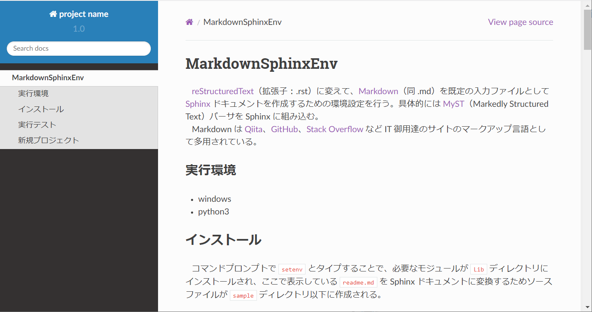

# MarkdownSphinxEnv

&nbsp;&nbsp; [reStructuredText](https://ja.wikipedia.org/wiki/ReStructuredText)（拡張子：.rst）に変えて、[Markdown](https://ja.wikipedia.org/wiki/Markdown)（同 .md）を既定の入力ファイルとして [Sphinx](https://www.sphinx-doc.org/ja/master/) ドキュメントを作成するための環境設定を行う。具体的には [MyST](https://myst-parser.readthedocs.io/en/latest/)（Markedly Structured Text）パーサを Sphinx に組み込む。<br>
&nbsp;&nbsp; Markdown は [Qiita](https://qiita.com/)、[GitHub](https://github.co.jp/)、[Stack Overflow](https://stackoverflow.com/) など IT 御用達のサイトのマークアップ言語として採用されている。
reStructuredText に比べて表現能はやや劣るが、学習コストは小さい。

## 実行環境

* windows
* python3

## インストール

&nbsp;&nbsp; 下記のコマンドで、必要なモジュールが `Lib` ディレクトリにインストールされ、ここで表示している `readme.md` を Sphinx ドキュメントに変換するためソースファイルが `sample` ディレクトリ以下に作成される。

```sh
setenv
```

&nbsp;&nbsp; この段階で以下が表示される場合は、`setenv.bat` の 18 行目より前で `PYTHONHOME` 変数（python.exe のディレクトリ）を自身の設定に合わせて修正した後、`setenv.bat` を再実行する。

```sh
   ERROR !   PYTHONHOME is not defined.
   Check this Script
```

## 実行テスト

&nbsp;&nbsp; 次のコマンドを実行して動作確認を行う。

```sh
cd sample
make
```

&nbsp;&nbsp; 上記が正常終了する場合は `build` ディレクトリ以下に .html 他が作成される。
次のコマンドは既定の web ブラウザでこれを表示する。
ここでは `readme.md` を sphinx ドキュメントに変換した下図のコンテンツが表示される。
正常に表示されたならば `sample` 以下は消去しても良い。

```sh
build\index.html
```



&nbsp;&nbsp; この段階で、組み込まれている拡張機能は以下となっている（[sphinx](https://www.sphinx-doc.org/en/master/usage/extensions/index.html)、[MySt](https://myst-parser.readthedocs.io/en/latest/syntax/optional.html) ）。必要があれば `setenv.bat` の 43 行目あるいは 69 行目を編集して既定の設定を変更することができる。
&nbsp;&nbsp; また、sphinx のテーマとして `sphinx_rtd_theme` を採用している。

* myst_parser
    * amsmath：latex の amsmath パッケージを使用
    * dollarmath：latex のインライン数式を `$` で、ディスプレイ数式を `$$ ... $$` で表記
* sphinx.ext.mathjax：[mathjax](https://www.mathjax.org/) を使用
* sphinx.ext.autodoc：docstring を自動的に読み込む
* sphinx.ext.napoleon：[napoleon](https://sphinxcontrib-napoleon.readthedocs.io/en/latest/) を使用
* sphinx_copybutton：コードブロックにコピーボタンを追加

### 数式のレンダリング

&nbsp;&nbsp; 数式が以下の通り、.md で記述されているものとする。

```md
**Reynolds equations**

$$
\frac{\partial{u}_i}{\partial t}
     + \frac{\partial\bigl({u}_i u_j\bigr)}{\partial x_j}
    = X_i - \frac{1}{\rho}\frac{\partial{p}}{\partial x_i}
     + \frac{\partial}{\partial x_j}\! \left(
        \nu \frac{\partial{u}_i}{\partial x_j}
      \right)
$$

Where, $t$ : time, $x_i$ : space, $u_i$ : velocity, 
$X_i$ : external force, $\rho$ : density, $\nu$ : kinematic viscosity.
```

&nbsp;&nbsp; このスクリプトは sphinx のみならず、他の markdown パーサでも以下のようにレンダリングされ、.tex のソースを殆ど変更することなく流用できる。

**Reynolds equations**

$$
\frac{\partial{u}_i}{\partial t}
     + \frac{\partial\bigl({u}_i u_j\bigr)}{\partial x_j}
    = X_i - \frac{1}{\rho}\frac{\partial{p}}{\partial x_i}
     + \frac{\partial}{\partial x_j}\left(
        \nu \frac{\partial{u}_i}{\partial x_j}
      \right)
$$

Where, $t$ : time, $x_i$ : space, $u_i$ : velocity, 
$X_i$ : external force, $\rho$ : density, $\nu$ : kinematic viscosity.

## 新規プロジェクト

&nbsp;&nbsp; 以下のコマンドで `foo` プロジェクトが作成される。

```bash
setenv foo
```

&nbsp;&nbsp; この段階で `foo` ディレクトリ以下は次の構成となる。
ファイルは全て `readme.md` のファイルをコピーしたものとなっているため、`foo` プロジェクトに相応しい内容に編集し直す必要がある。

```
foo
│  make.bat
├─build
└─source
    │  conf.py
    │  index.md
    ├─_images
    ├─_static
    └─_templates
```

### make.bat

&nbsp;&nbsp; `setenv.bat` が自動生成する `make.bat` は web コンテンツのみを出力する仕様とした。
変更する場合は[この記事](https://www.sphinx-doc.org/ja/master/man/sphinx-build.html)を参考に `make.bat` を修正するか、`make.bat` を実行する際に引数を加える。例えば、`make -a` はリビルドするコマンドとなる。

### souce\conf.py

&nbsp;&nbsp; 9 行目から 13 行目を変更する。

```Python
project = 'project name'
copyright = '2022, author names'
author = 'author names'

version = '1.0'
release = '0'
```

&nbsp;&nbsp; その他、[この記事](https://myst-parser.readthedocs.io/en/latest/configuration.html)を参考に必要な変更を行う。 

### souce\index.md

&nbsp;&nbsp; `index.md` は sphinx ドキュメントの先頭ページであり、目次を記述する。
例えば、記事を `chapter_[1-3].md` の 3 つのファイルに分けて記述する場合、以下のように変更する。

````md
# Table of Contents
```{toctree}
---
maxdepth: 3
---
chapter_1.md
chapter_2.md
chapter_3.md
```
* [Index](genindex)
* [Search](search)
````

&nbsp;&nbsp; `index.md` 以外の .md は[一般的な記法](https://ja.wikipedia.org/wiki/Markdown#%E8%A8%98%E6%B3%95%E3%81%AE%E4%BE%8B)に加えて、以下を参照に記述する。

* [MyST's core syntax](https://myst-parser.readthedocs.io/en/latest/syntax/syntax.html#)
* [syntx extension](https://myst-parser.readthedocs.io/en/latest/syntax/optional.html).

### source/_images

&nbsp;&nbsp; プロジェクト固有の画像ファイルは `source/_images` に登録し、次の行で表示させる。
ちなみに、.md で先頭の `!` がない場合は通常のハイパーリンクとなる。

```md

```

&nbsp;&nbsp; `source/_images` のファイルは `buid/_images` にコピーされるので、体裁を整える場合は .md で次のように記述することもできる。このように、.md では直接 HTML が挿入可能である。

```html
<div align="center">
    
</div><br>
```
