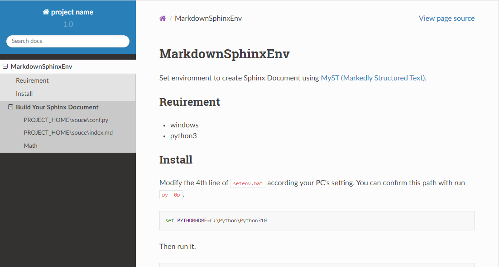
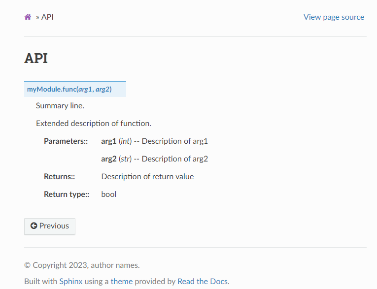

# MarkdownSphinxEnv

Set environment to create Sphinx Document using [MyST (Markedly Structured Text)](https://myst-parser.readthedocs.io/en/latest/).

## Reuirement

* windows
* python3

## Install

Modify the 4th line of `setenv.bat` according your PC's setting.
You can confirm this path with run `py -0p`.

```bash
set PYTHONHOME=C:\Python\Python310
```

Then run it.

```bash
setenv
```

This command create new directory `Lib` and `myProject` as below.
`Lib` is libraries to build Sphinx Document.
`myProject` is temporary, so you can reneme as you like.

```bash
.
+---.git\
|   .gitignore
|   readme.md
|   requirements.txt
|   setenv.bat
+---img\
+---Lib\
|   +---bin\
|   |       sphinx-quickstart.exe
|   |       sphinx-build.exe
|   |       the other modules
|   +---sphinx\
|   +---sphinx_rtd_theme\
|   +---myst_parser\
|   \---the other libralies\
\---myProject\
    |   make.bat
    +---build\
    \---source\
        |   conf.py
        |   index.md
        |   readme.md
        +---_img\
        +---_static\
        \---_templates\
```

When add another project, type like below.

```bash
setenv another
```

## Build Your Sphinx Document

If you type as below before edit files in `myProject\source\`,
Web contents shown below are created at `myProject\build\html\`. 

```bash
cd myProject
make
```



###  PROJECT_HOME\souce\conf.py

Edit the 9-13th lines according to your project.

```Python
project = 'project name'
copyright = '2022, author names'
author = 'author names'

version = '1.0'
release = '0'
```

You can set another option with editting this file. See [Configuration](https://myst-parser.readthedocs.io/en/latest/configuration.html) in detail. 

###  PROJECT_HOME\souce\index.md

The `index.md` describe portal page.
Below sample shows in case consists 3 chapters.
`chapter_[1-3].md` follows [MyST's core syntax](https://myst-parser.readthedocs.io/en/latest/syntax/syntax.html#) and [syntx extension](https://myst-parser.readthedocs.io/en/latest/syntax/optional.html).

````md
# Table of Contents
```{toctree}
---
maxdepth: 2
---
chapter_1.md
chapter_2.md
chapter_3.md
```
* [Index](genindex)
* [Search](search)
````

### Math

The current `conf.py` is added `dollarmath` extension. So, you can use `$...$` for inline math, and `$$...$$` for display math. 

```md
**Reynolds equations**

$$
\frac{\partial{u}_i}{\partial t}
     + \frac{\partial\bigl({u}_i u_j\bigr)}{\partial x_j}
    = X_i - \frac{1}{\rho}\frac{\partial{p}}{\partial x_i}
     + \frac{\partial}{\partial x_j}\! \left(
        \nu \frac{\partial{u}_i}{\partial x_j}
      \right)
$$

Where, $t$ : time, $x_i$ : space, $u_i$ : velocity, 
$X_i$ : external force, $\rho$ : density, $\nu$ : kinematic viscosity.
```

**Reynolds equations**

$$
\frac{\partial{u}_i}{\partial t}
     + \frac{\partial\bigl({u}_i u_j\bigr)}{\partial x_j}
    = X_i - \frac{1}{\rho}\frac{\partial{p}}{\partial x_i}
     + \frac{\partial}{\partial x_j}\left(
        \nu \frac{\partial{u}_i}{\partial x_j}
      \right)
$$

Where, $t$ : time, $x_i$ : space, $u_i$ : velocity, 
$X_i$ : external force, $\rho$ : density, $\nu$ : kinematic viscosity.


## API Document

Extension [napoleon](https://www.sphinx-doc.org/ja/master/usage/extensions/napoleon.html) includes in `conf.py`.
So, if you describe `docstring` with Google or Numpy style into your source code (`myModule.py`), below markdown `api.md` builds easy readable API document.

```Python
# myModule.py
def func(arg1, arg2):
    """Summary line.

    Extended description of function.

    Args:
        arg1 (int): Description of arg1
        arg2 (str): Description of arg2

    Returns:
        bool: Description of return value

    """
    return True
```

````md
<!-- api.md -->
# API
```{eval-rst}
.. automodule:: myModule
   :members:
   :undoc-members:
   :show-inheritance:
```
````



