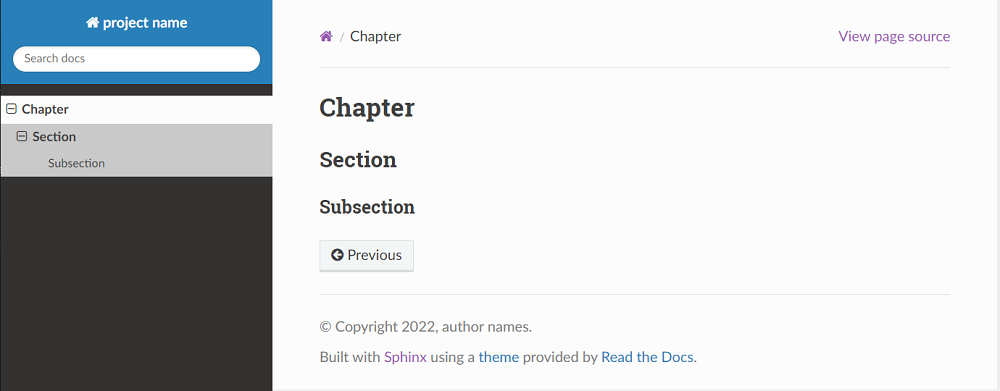

# MarkdownSphinxEnv

Set environment to create Sphinx Document using [MyST (Markedly Structured Text)](https://myst-parser.readthedocs.io/en/latest/).

## Reuirement

* windows
* python3

## Preparement

Modify the 4th line of `setenv.bat` according your PC's setting.
You can confirm this path with run `py -0p`.

```cmd
set PYTHONHOME=C:\Python\Python310
```

## Make Environment

The command `set_env.bat` create bellow directories and files.
Directory `.venv` is virtual environments to build Shinx Document.
Name `myProject` is temporary, so reneme as you like.

```cmd
set_env.bat
```

```cmd
.
|   .git
|   .gitignore
|   readme.md
|   requirements.txt
|   set_venv.bat
|   sphinx.PNG
|   start.bat
+---.venv\
|   |   pyvenv.cfg
|   +---Include\
|   +---Lib\
|   \---Scripts\
\---myProject\
    |   make.bat
    +---build\
    \---source\
        |   conf.py
        |   index.md
        |   renameMe.md
        +---_static\
        \---_templates\
```

To create another project, run `set_proj.bat project-name`.

## Make HTML Shinx Document

If you type as bellow before edit files in `myProject\source\`,
bellow Web contents are created at `myProject\build\html\`. 

```cmd
cd myProject
make.bat
```



###  PROJECT_HOME\souce\conf.py

Edit the 9-12th lines according to your project.

```Python
project = 'project name'
copyright = '2022, author names'
author = 'author names'
release = '1.0'
```

###  PROJECT_HOME\souce\index.md

The `index.md` describe table of contents.
Bellow sample shows in case consists 3 chapters.

````md
# Table of Contents
```{toctree}
---
maxdepth: 2
---
chapter_1.md
chapter_2.md
chapter_3.md
```
* [Index](genindex)
* [Search](search)
````
